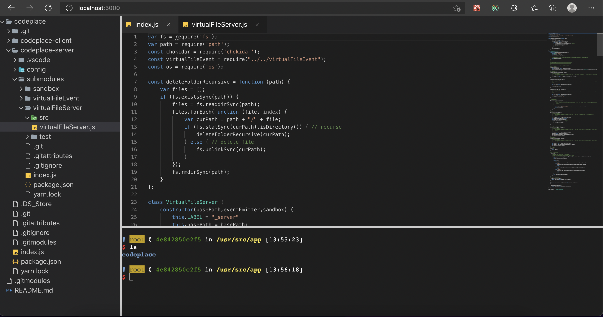
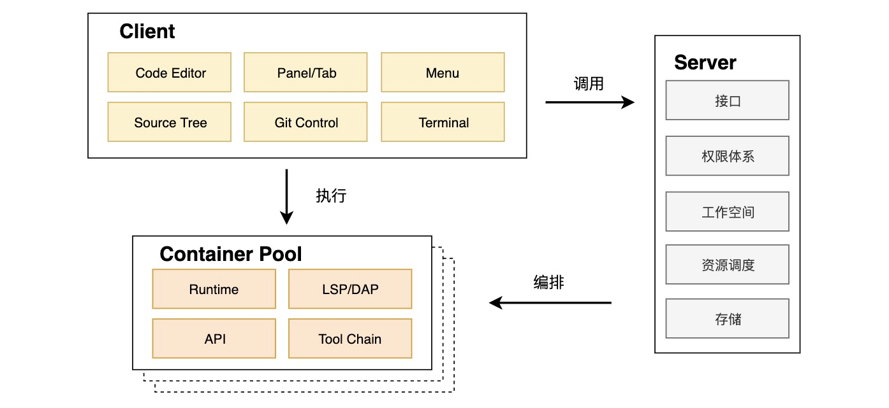

<p align="center">
    
</p>

<p align="center"><b>codeplace</b> 一款完全开源的轻量级Cloude IDE</p>
<div style='margin:0 auto;width:80%;'>



</div>

> 随着开发技术的发展更迭，日常开发工作变得愈发复杂愈发深入，同时工程中从项目初始化、编译、构建到发布、运维也变得细化而成熟。本地开发环境存在开发机性能要求高、开发环境配置复杂、依赖特定设备、复杂工程管理难等问题，Cloud IDE 很好的解决了这些问题。最近几年，Cloud IDE 在开发全流程领域扮演者越来越重的角色，国内外很多大厂商都在做 Cloud IDE。

> CodePlace是一款基于React，Nodejs，Docker等开发的轻量级Cloud IDE，使得用户无需维护复杂的编程环境即可在浏览器端获得高效的开发体验。`与当下众多Cloud IDE产品基于Eclipse-Theia二次开发不同。该项目完全从零开始，一步一步构建出轻量级的Cloud IDE，可进行深度定制及二次开发。`

### 技术简介
**架构**


**项目简介**
> 采用前后端分离开发，前端采用React模块化构建，后端使用Nodejs。

**前端**
> 完全采用函数式组件及React hooks开发，集成了MonacoEditor及XtermJs，前后端使用websocket交互，使用socketIO基于事件驱动运行。

**后端**
> 采用nodejs + chokidar + dockerode + docker
> 自动创建并管理docker容器，自动管理并暴露docker流，在前端将xterm接入该流中模拟终端

### 各仓库介绍
> [codeplace-client](https://github.com/codePlaceOfficial/codeplace-client) : 前端，基于React开发，使用create-react-app创建管理
> [codeplace-server](https://github.com/codePlaceOfficial/codeplace-server) : 后端，由express框架构建


<!-- > `virtualFile` 系列库用于实现前后端文件双向同步,前端文件修改会同步到后端，通过终端手动修改后端文件时也会自动推送到前端，并且支持按需获得文件内容节省流量
 -->
> [virtualFileClient](https://github.com/codePlaceOfficial/virtualFileClient): 运行在前端用于管理文件系统，接收后端传来的文件操作事件，进行虚拟文件操作，并生成相应的obj格式的虚拟文件
 
> [virtualFileServer](https://github.com/codePlaceOfficial/virtualFileServer)：运行在服务器端接受前端发来的文件操作事件进行相应，并且会监控本地文件的改动自动将文件变动生成事件推送给前端
 
> [virtualFileEvent](https://github.com/codePlaceOfficial/virtualFileEvent)：生成并推送文件操作事件，在virtualFileClient和virtualFileServer中均有使用。

> [sandbox](https://github.com/codePlaceOfficial/sandbox)：用于维护并管理docker容器实例，并使用class包装，使用codeplaceofficial/compiler:0.2镜像，可以直接运行代码和得到tty流

> [compiler](https://github.com/codePlaceOfficial/compiler):存储dockerfile文件，用于构建codeplaceofficial/compiler镜像，基于ubuntu:20.04修改,集成了c/c++,ruby,python,go,nodejs,java,rust……等运行环境，使用zsh作为默认终端环境

### 视频演示

https://user-images.githubusercontent.com/96987305/154922355-235eb461-60b7-4b8b-ad56-ce3d6adb4dec.MP4

### 快速开始
``` bash
# 拉取代码
git clone https://github.com/codePlaceOfficial/codeplace.git
git submodule update --init --recursive

# 拉取docker镜像
docker pull codeplaceofficial/compiler:0.2

# 使用npm或者yarn安装依赖
git submodule foreach --recursive yarn # or
git submodule foreach --recursive npm

# 开启服务器
cd codeplace-server && yarn dev
# 开启react
cd codeplace-client && yarn start
```
